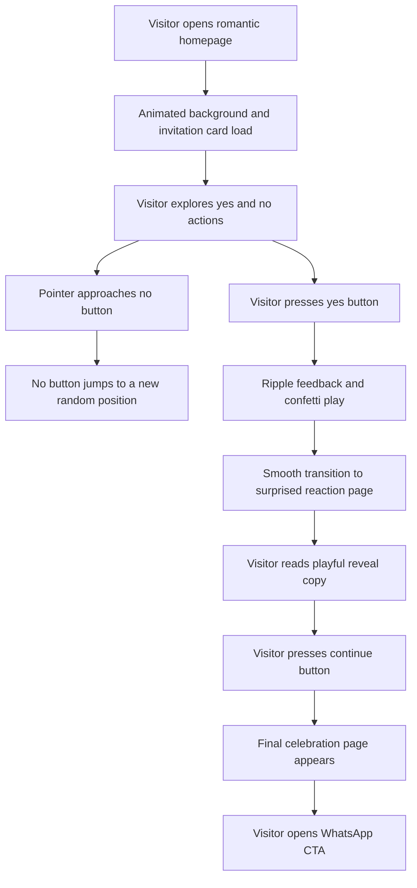

## 1. Product Overview
Romantic Date Website is a playful interactive single-purpose experience designed to invite someone on a date through a polished, emotionally expressive flow.
- The product turns a simple question into a memorable romantic micro-experience with motion, humor, delight, and a clear WhatsApp call to action.
- Its value comes from emotional impact, shareability, strong mobile presentation, and instant usability without setup friction.

## 2. Core Features

### 2.1 Feature Module
1. **Home page**: centered romantic invitation card, decorative motion background, evasive "No" interaction, cursor effects, music toggle
2. **Reaction page**: celebratory reveal after accepting, surprise copy, image section, transitional CTA
3. **Final page**: confirmation message, animated heart, WhatsApp CTA, romantic finish state

### 2.2 Page Details
| Page Name | Module Name | Feature Description |
|-----------|-------------|---------------------|
| Home page | Hero card | Shows a replaceable romantic image, invitation title, short supporting copy, and two action buttons inside a glassmorphism card |
| Home page | YES button | Uses a pink gradient, heart icon, hover scale animation, ripple click effect, and triggers acceptance flow with confetti |
| Home page | NO button | Uses a purple style and continuously escapes pointer proximity with randomized motion; on touch devices it relocates when tapped |
| Home page | Decorative scene | Renders floating hearts, sparkles, floral accents, soft gradient atmosphere, custom cursor, and mouse heart trail |
| Home page | Music control | Toggles optional background music with clear accessible controls and persisted client preference |
| Home page | Loading state | Displays a cute animated loading experience before the main scene fully settles |
| Reaction page | Surprise reveal card | Shows a larger romantic card, replaceable image, dramatic heading, subtitle, and animated entrance |
| Reaction page | Transitional CTA | Provides a clear button to continue to the final celebratory page with smooth page transition |
| Final page | Celebration card | Shows the final romantic message, animated heart, supportive microcopy, and polished glassmorphism presentation |
| Final page | WhatsApp CTA | Opens the configured WhatsApp deep link in a new tab and is visually emphasized as the primary next action |
| Shared | SEO metadata | Adds page metadata, title, description, theme colors, social-friendly defaults, and favicon support |
| Shared | Accessibility | Supports keyboard navigation where possible, reduced-motion handling, semantic structure, visible focus states, contrast-aware dark mode, and descriptive labels |

## 3. Core Process
The visitor lands on a romantic invitation homepage with animated hearts, sparkles, and a playful glass card. They can try to interact with both options, but the "No" button evades them while the "Yes" button rewards acceptance with ripple feedback and confetti. After choosing yes, the user transitions to a surprised reaction page, then continues to a final celebration page with a direct WhatsApp call to action.

## 4. User Interface Design

### 4.1 Design Style
- Primary palette: layered blush pink, rose, peach cream, soft berry, and moonlit plum for contrast
- Secondary palette: romantic lavender, champagne white, and deep charcoal accents for dark mode
- Surface style: glassmorphism cards with soft blur, translucent borders, floral glow, and rounded corners
- Button style: pill-shaped CTA buttons with animated gradients, cute shadows, tactile scaling, and bounce reactions
- Typography: a decorative romantic display font paired with a refined readable body font, both delivered through Next.js font optimization
- Layout style: desktop-first centered storytelling cards with surrounding floating decorations and carefully tuned mobile stacking
- Icon style: heart-forward icons, soft sparkles, delicate floral forms, and expressive emoji used sparingly in hero copy

### 4.2 Page Design Overview
| Page Name | Module Name | UI Elements |
|-----------|-------------|-------------|
| Home page | Hero card | Large frosted card, replaceable image frame, layered title, typewriter subtext, glowing action row, subtle border shimmer |
| Home page | Animated atmosphere | Floating heart particles, sparkles, gradient mesh backdrop, floral corner ornaments, ambient blur spots, and optional grain texture |
| Home page | Cursor system | Custom cursor treatment on desktop, small heart trail following pointer movement, responsive fallbacks for touch devices |
| Reaction page | Reveal card | Oversized image, dramatic heading reveal, subtitle motion, background bloom, and CTA with forward-arrow momentum |
| Final page | Celebration card | Big romantic heading, animated heart centerpiece, reassuring message stack, WhatsApp CTA, and looping ambient motion |
| Shared | Dark mode | Carefully tuned night palette preserving warmth, glow, contrast, and readability without losing the romantic aesthetic |

### 4.3 Responsiveness
- Desktop-first design with graceful scaling down to tablet and mobile
- Touch-friendly hit targets, layout compression, and reduced decorative density on small screens
- Motion and particle density adapt based on screen size and user preferences
- The evasive "No" button remains functional and playful on both pointer and touch devices
- Cards, typography, and controls maintain readability and spacing from small phones to wide desktop displays

### 4.4 Motion and Delight Guidance
- Use soft spring-based transitions, staggered card reveals, floating ambient movement, and celebratory exit/enter animations
- Prioritize emotionally expressive motion for the yes-action moment, page transitions, and animated heart sequences
- Respect reduced-motion preferences by simplifying non-essential motion while keeping the flow understandable
- Ensure decorative effects never block core interactions or reduce performance on mobile devices
