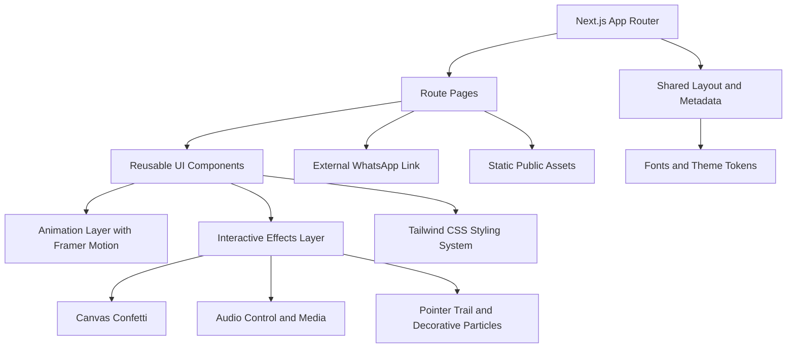

## 1. Architecture Design
The application is a frontend-focused Next.js 15 website using the App Router. State is primarily local and client-side, with no backend required for the core experience. External services are limited to optional web-hosted assets and the outbound WhatsApp deep link.



## 2. Technology Description
- Frontend: Next.js 15 + React + TypeScript
- Routing: App Router with route segments for each stage of the romantic flow
- Styling: Tailwind CSS with design tokens, gradients, translucency utilities, and dark mode class strategy
- Animation: Framer Motion for entrances, transitions, floating elements, shared motion patterns, and button feedback
- Icons: Lucide React for heart, music, sparkles, arrow, and accessibility-friendly decorative icons
- Effects: canvas-confetti for acceptance celebration, react-type-animation for typewriter messaging
- Fonts: Next.js optimized web fonts chosen to support a playful romantic display/body pairing
- Tooling: ESLint, PostCSS, and Next.js production defaults

## 3. Route Definitions
| Route | Purpose |
|-------|---------|
| / | Home page with the invitation card, evasive "No" button, background effects, and acceptance interaction |
| /wait-what | Reaction page shown immediately after acceptance with surprised message and continue CTA |
| /yay | Final celebration page with animated heart, romantic message, and WhatsApp CTA |

## 4. API Definitions
No backend API is required for the initial release.

Client-side data contracts:

```ts
type RomanticImageConfig = {
  src: string;
  alt: string;
  priority?: boolean;
};

type WhatsAppConfig = {
  url: string;
  label: string;
};

type MotionPreference = {
  reducedMotion: boolean;
  soundEnabled: boolean;
};
```

## 5. Component Architecture
| Component | Responsibility |
|-----------|----------------|
| `AnimatedButton` | Shared CTA with variants, hover/tap motion, ripple effect support, and icon placement |
| `FloatingHearts` | Continuous animated heart particles layered behind the main content |
| `ConfettiEffect` | Encapsulates confetti trigger logic after yes selection |
| `GlassCard` | Shared glassmorphism surface with blur, border glow, responsive spacing, and shadow presets |
| `Typewriter` | Renders animated romantic subtext with accessible fallback text |
| `MusicPlayer` | Manages ambient audio toggle, playback state, and persisted preference |
| `CursorTrail` | Creates tiny heart cursor trail on desktop with touch-safe disable logic |
| `HeartBackground` | Composes ambient gradients, sparkles, hearts, flowers, and decorative scene layers |
| `CustomCursor` | Optional cursor enhancement for desktop devices |
| `LoadingScreen` | Cute initial loading animation for route or first-render presentation |
| `PageTransition` | Shared wrapper for smooth page entrance and exit animation behavior |

## 6. State and Interaction Model
- Use lightweight local React state for hover, ripple, loading, and route-transition triggers
- Store music preference in `localStorage` and initialize only on the client
- Detect pointer capabilities to switch between hover-driven and tap-driven evasive button behavior
- Gate expensive visual effects behind mounted state to avoid server/client rendering mismatches
- Use reduced-motion media queries and Framer Motion hooks to scale back non-essential animation

## 7. Directory Structure
| Path | Purpose |
|------|---------|
| `app/` | App Router pages, layout, loading UI, metadata, and route-level transitions |
| `components/` | Reusable presentational and interaction components |
| `hooks/` | Shared hooks for cursor position, mounted state, media queries, music settings, and evasive button logic |
| `lib/` | Configuration, animation presets, utility helpers, theme tokens, and constants |
| `public/` | Replaceable romantic images, audio file, favicon assets, and optional decorative textures |

## 8. Styling Strategy
- Define theme tokens through CSS custom properties for light and dark mode consistency
- Build reusable Tailwind utility patterns for card glow, romantic shadows, button gradients, and floating particle layers
- Use layered absolute-positioned decorative components separated from semantic content containers
- Apply backdrop blur and transparency carefully to keep text legible across both themes

## 9. Accessibility and Quality Requirements
- Semantic heading hierarchy and landmark usage on every page
- Keyboard focus states for all meaningful interactive elements
- Decorative particles and cursor effects marked non-semantic and ignored by assistive tech
- Audio remains optional and muted by default until the user intentionally enables it
- Responsive and reduced-motion behavior verified during development
- Metadata, favicon, descriptive alt text, and color contrast included in the release

## 10. Performance Strategy
- Keep decorative animations GPU-friendly using transforms and opacity
- Limit particle counts on smaller screens
- Optimize static assets through `next/image`
- Use client components only where interaction requires them
- Defer non-critical effects until after initial mount for smoother first paint
